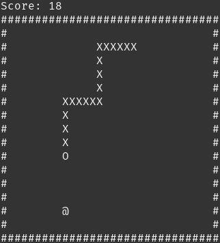

# abclisnake

*abclisnake* is the command-line version of Snake, a classic game. In *abclisnake*, the player loses when the snake runs
into either the game field border, or itself. This game has been developed on Linux, for Linux. Although, it may be
working on any UNIX-based OS.

# Game preview:

# Dependencies
### CMake
* Debian or Debian-based distro (Ubuntu, Linux Mint etc.)

    `sudo apt install cmake`

* Arch or Arch-based distro (Manjaro, Antergos etc.)

    `sudo pacman -S cmake`

* Fedora

    `sudo dnf install cmake`

# Installation
    ./build.sh
    (execute 'chmod +x build.sh' if you cannot run the script)
To run the game, type `./abclisnake`.

# Keybindings:
    - [SPACE] for starting the game (the player will be prompted to press the key in order to start playing the game);
    - [W] (UP), [A] (LEFT), [S] (DOWN), [D] (RIGHT) for changing snake's moving direction;
    - [P] for pausing the game (and unpausing it);
    - [Q] for quitting the game.
